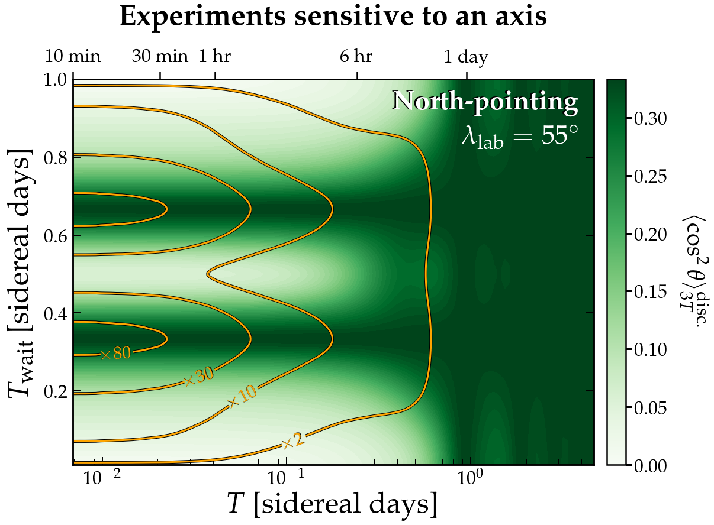

[](https://arxiv.org/abs/2105.04565)
[](https://opensource.org/licenses/mit-license.php)


# Dark Photon Cookbook
Python-3 Code to reproduce the results from our paper arXiv:[2105.XXXXX] "Dark photons: a cookbook"

The code is relatively uncomplicated, just a few short python notebooks for evaluating the expressions in the paper, and doing some simple Monte Carlo distributions. If you are here looking for the code and data needed to make the Dark Photon limit plots, you need to head to [this repo](https://github.com/cajohare/AxionLimits) instead.

If you need any assistance or have any questions, contact me at ciaran.aj.ohare@gmail.com

If you use anything here please cite the paper, [Caputo et al. 2021](https://arxiv.org/abs/2105.04565)
```
@article{Caputo:2021,
    author = "Caputo, A. and O'Hare, C.A.J. and Millar, A.J. and Vitagliano, E.",
    title = "{Dark photon limits: a cookbook}",
    eprint = "2105.04565",
    archivePrefix = "arXiv",
    primaryClass = "hep-ph",
    month = "05",
    year = "2021"
}
```

# Requirements
* [`cmocean`](https://matplotlib.org/cmocean/)
* [`numba`](http://numba.pydata.org/)
* [`tqdm`](https://pypi.org/project/tqdm/)

# Contents
* [`code/`](https://github.com/cajohare/DarkPhotonCookbook/tree/main/code) contains python code and notebooks 
* [`mathematica/`](https://github.com/cajohare/DarkPhotonCookbook/tree/main/mathematica) contains a single mathematica notebook that demonstrates a few of the analytic results
* [`plots/`](https://github.com/cajohare/DarkPhotonCookbook/tree/main/plots) contains all the plots in pdf and png formats
* [`diagrams/`](https://github.com/cajohare/DarkPhotonCookbook/tree/main/diagrams) a few keynote files which we used to make the diagrams in the paper

# Code
* [`LabFuncs.py`](https://github.com/cajohare/DarkPhotonCookbook/blob/master/LabFuncs.py) functions for calculating angles
* [`PlotFuncs.py`](https://github.com/cajohare/DarkPhotonCookbook/blob/master/PlotFuncs.py) contains various things needed to make the plots

# Notebooks
[](https://github.com/cajohare/DarkPhotonCookbook/raw/master/plots/plots_png/LocationDependence.png)
### [Latitude dependence:](https://github.com/cajohare/DarkPhotonCookbook/blob/master/LocationDependence.ipynb)
This plot is to show the preferential latitudes for doing day-long measurements, the locations at the peaks of these curves are about as good as an experiment could ever do. Integer-day long measurements are also the best.
### &nbsp;
### &nbsp;
### &nbsp;
### &nbsp;
---
[](https://github.com/cajohare/DarkPhotonCookbook/raw/master/plots/plots_png/North_costh_dist.png)
### [Geometry factor distributions:](https://github.com/cajohare/DarkPhotonCookbook/blob/master/Polarisation_Angles.ipynb)
This notebook creates the full distributions of the geometry factor for a range of measurement times and for a range of experimental orientations and latitudes
### &nbsp;
### &nbsp;
### &nbsp;
### &nbsp;
---
[](https://github.com/cajohare/DarkPhotonCookbook/raw/master/plots/plots_png/Improvement_Plane.png)
### [Improvement factors:](https://github.com/cajohare/DarkPhotonCookbook/blob/master/Improvement.ipynb)
These plots are for demonstrating the improvement that you get when accounting for the timing and direction information relative to the case where you just ignore it all together. The upper dashed line is the best any experiment could hope to do.
### &nbsp;
### &nbsp;
### &nbsp;
### &nbsp;
---
[](https://github.com/cajohare/DarkPhotonCookbook/raw/master/plots/plots_png/RescanTwice_North.png)
### [Making multiple measurements:](https://github.com/cajohare/DarkPhotonCookbook/blob/master/Polarisation_rescan_Twice.ipynb)
These plots show when the best time to do a second and third measurement, to stack onto an earlier one. There is also an earlier version for just two measurements instead of three which can be found [here](https://github.com/cajohare/DarkPhotonCookbook/blob/master/Polarisation_rescan.ipynb)
### &nbsp;
### &nbsp;
### &nbsp;
### &nbsp;
---
[](https://github.com/cajohare/DarkPhotonCookbook/raw/master/plots/plots_png/PolarisationMap_Zenith.png)
### [Polarisation reconstruction:](https://github.com/cajohare/DarkPhotonCookbook/blob/master/Plot_PolarisationMaps.ipynb)
Assuming experiment measures the DP signal and monitors the daily modulation, could it reconstruct the DP polarisation: Yes.
### &nbsp;
### &nbsp;
### &nbsp;
### &nbsp;
