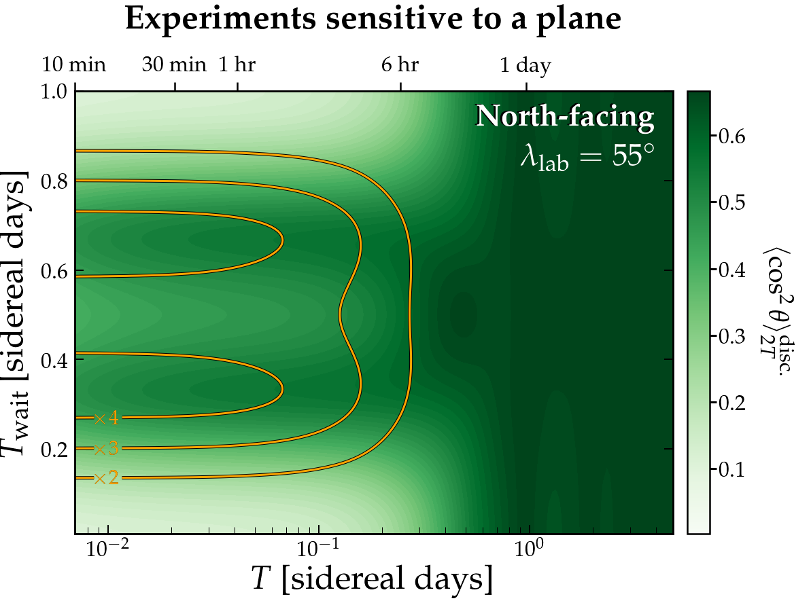

# Dark Photon Cookbook
Python-3 Code to reproduce the results from our paper arXiv:[2105.XXXXX] "Dark photons: a cookbook"

The code is relatively uncomplicated, just a few short python notebooks for evaluating the expressions in the paper, and doing some simple Monte Carlo distributions. 
If you are here looking for the code and data needed to make the Dark Photon limit plots, you need to head to [this repo](https://github.com/cajohare/AxionLimits) instead.

If you need any assistance or have any questions, contact me at ciaran.aj.ohare@gmail.com

# Requirements
* [`cmocean`](https://matplotlib.org/cmocean/)
* [`numba`](http://numba.pydata.org/)
* [`tqdm`](https://pypi.org/project/tqdm/)

# Examples:
Click to go to the notebook used to make the plot

---
